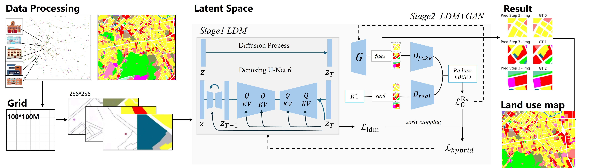

# ph-ldm-gan
POI-conditioned hybrid latent diffusion GAN for land-use map generation
[]()
[]()
[]()
[]()

---

## Overview

**PH-LDM-GAN** is a *POI-conditioned* hybrid generative framework that integrates **Latent Diffusion Models (LDMs)** with **adversarial refinement (GAN)** to generate high-resolution, functionally consistent urban land-use maps.  
It bridges semantic conditioning (via POI distributions) and spatial realism (via adversarial supervision), enabling automatic synthesis of fine-grained land-use layouts that align with real-world morphological patterns.

<p align="center">
  
</p>

---

## Key Features

- **Hybrid Diffusion-GAN Structure**  
  Combines diffusion denoising with adversarial refinement for sharper, more realistic map textures.  

- **POI-Conditioned Generation**  
  Learns spatial semantics from POI distributions and road networks, supporting controllable layout synthesis.  

- **R1 Regularized Discriminator**  
  Integrates zero-center gradient penalty (ZC-GP) for stable training under high-resolution conditions.  

- **Fine-Grained Urban Land-Use Synthesis**  
  Produces parcel-level and block-level land-use maps with clear zoning boundaries and realistic urban morphology.  


## Installation

```bash
git clone https://github.com/Asnow365/ph-ldm-gan.git
cd ph-ldm-gan
pip install -r requirements.txt
```

Required packages:
```
torch>=2.0
pytorch-lightning>=2.2
torchvision
torchmetrics
diffusers
matplotlib
scikit-learn
```

---

## Training

To train PH-LDM-GAN on your own POI-land-use dataset:

```bash
python train_phldmgan.py --data_path ./data/qingdao --epochs 200 --batch_size 4
```

> Example training datasets include **Qingdao**, **Xi’an**, and **Shijiazhuang**, each with paired POI-grid and functional zoning data.

---

## Evaluation

The model supports standard evaluation metrics for both image quality and functional accuracy:

| Metric | Description |
|---------|--------------|
| **FID** | Fréchet Inception Distance |
| **LPIPS** | Learned Perceptual Image Patch Similarity |
| **mIoU** | Mean Intersection over Union |
| **PSNR / SSIM** | Pixel-level and structural fidelity |

## License
This project is licensed under the MIT License — see the [LICENSE](LICENSE) file for details.
